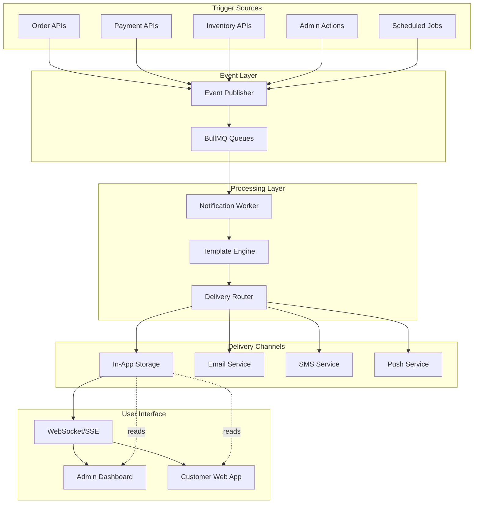
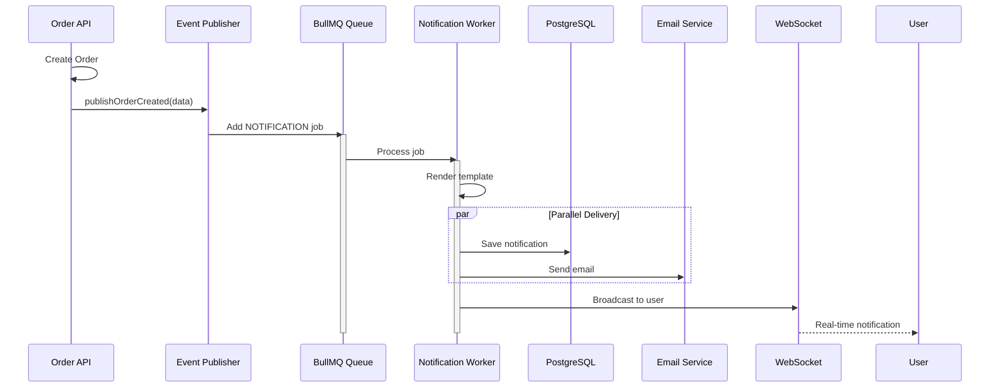

# Notification System - Complete Implementation Guide

> **Last Updated**: January 20, 2026  
> **Author**: Backend Architecture Team  
> **Status**: Planning Phase

---

## Table of Contents

1. [Executive Summary](#executive-summary)
2. [Current Application Review](#current-application-review)
3. [Notification System Architecture](#notification-system-architecture)
4. [Database Schema Design](#database-schema-design)
5. [Backend Implementation](#backend-implementation)
6. [Admin Panel Features](#admin-panel-features)
7. [User-Facing Features](#user-facing-features)
8. [Integration Guide](#integration-guide)
9. [Testing Strategy](#testing-strategy)
10. [Deployment Checklist](#deployment-checklist)

---

## Executive Summary

This document outlines a comprehensive end-to-end notification system for the Anant Enterprises platform, designed to provide real-time notifications for both admin panel and customer-facing website.

### Key Features
- ✅ **Multi-Channel Delivery**: In-app, Email, SMS (extendable to Push notifications)
- ✅ **Event-Driven Architecture**: Leverages existing BullMQ queue infrastructure
- ✅ **Real-Time Updates**: WebSocket/SSE support for instant notification delivery
- ✅ **Customizable Templates**: Dynamic email/SMS templates with variable substitution
- ✅ **User Preferences**: Fine-grained notification controls per user
- ✅ **Admin Dashboard**: Monitor, manage, and broadcast notifications
- ✅ **Scalable Design**: Built on proven queue-based architecture

---

## Current Application Review

### Tech Stack Overview

| Component | Technology | Status |
|-----------|-----------|--------|
| **Runtime** | Node.js 18+ | ✅ Active |
| **Framework** | Express 5.1.0 | ✅ Active |
| **Language** | TypeScript 5.7+ | ✅ Active |
| **Database** | PostgreSQL (Supabase) | ✅ Active |
| **ORM** | Drizzle ORM 0.45+ | ✅ Active |
| **Caching** | Redis 5.10+ | ✅ Active |
| **Queue System** | BullMQ 5.66+ | ✅ Active |
| **Email** | Nodemailer 7.0+ | ✅ Active |
| **Authentication** | JWT | ✅ Active |
| **Validation** | Zod 4.3+ | ✅ Active |

### Existing Features

#### 1. Queue Infrastructure (`src/features/queue`)

**Status**: ✅ Fully Operational

The application already has a robust event-driven architecture:

```typescript
// Existing Queue System
├── services/
│   ├── queue.service.ts         // Queue orchestration
│   ├── event-publisher.service.ts // Event publishing
│   └── workers/
│       ├── order.worker.ts      // Order event processing
│       ├── payment.worker.ts    // Payment processing
│       ├── inventory.worker.ts  // Inventory management
│       └── notification.worker.ts // ✅ Already exists!
```

**Key Capabilities**:
- Event publishing with type safety
- Retry mechanisms with exponential backoff
- Job prioritization (CRITICAL, HIGH, NORMAL, LOW)
- Error handling and logging
- Graceful shutdown

**Existing Notification Events**:
```typescript
// Already implemented in event-publisher.service.ts
publishEmailNotification(data: EmailNotificationData)
publishSMSNotification(data: SMSNotificationData)
publishUserRegistered(data: UserRegisteredData)
```

#### 2. Order Management (`src/features/orders`)

**Status**: ✅ Comprehensive

**Events Already Supported**:
- `ORDER_CREATED` - New order placement
- `ORDER_PAID` - Payment confirmation
- `ORDER_SHIPPED` - Order dispatch
- `ORDER_CANCELLED` - Order cancellation

**Integration Points**:
- Order creation triggers notification
- Status updates propagate to users
- Email confirmations available

#### 3. Inventory Management (`src/features/inventory`)

**Status**: ✅ Advanced

**Events Already Supported**:
- `INVENTORY_RESERVED` - Stock allocation
- `INVENTORY_RELEASED` - Stock release
- `INVENTORY_ADJUSTED` - Manual adjustments
- `LOW_STOCK_ALERT` - Low stock warnings
- `OUT_OF_STOCK_ALERT` - Out of stock alerts

**Tables**:
- `inventory_locations` - Warehouse management
- `inventory` - Stock tracking
- `inventory_adjustments` - Audit trail
- `production_orders` - Manufacturing orders

#### 4. User System (`src/features/user`)

**Status**: ✅ Feature-Rich

**User Types**:
- **Individual Customers** - B2C users
- **Business Customers** - B2B accounts with tiers
- **Admin Users** - Internal staff

**Existing Schemas**:
- `users` - Core user data (email, phone, name)
- `customer_profiles` - Customer metadata
- `business_customer_profiles` - B2B customer data
- `admin_profiles` - Admin-specific data
- `user_addresses` - Delivery addresses

**Authentication**: JWT-based with role-based access control (RBAC)

#### 5. Payment Processing (`src/features/payments`)

**Status**: ✅ Production-Ready

**Integration**: Razorpay payment gateway

**Events**:
- `PAYMENT_AUTHORIZED` - Payment hold
- `PAYMENT_CAPTURED` - Payment success
- `PAYMENT_FAILED` - Payment failure
- `PAYMENT_REFUNDED` - Refund processed

#### 6. Email Infrastructure

**Status**: ✅ Configured

**Library**: Nodemailer 7.0+

**Capabilities**:
- SMTP configuration
- HTML email templates
- Attachment support
- Error handling

**Environment Variables**:
```bash
EMAIL_SERVICE=gmail
EMAIL_USER=notifications@anantenterprises.com
EMAIL_PASSWORD=***
EMAIL_FROM="Anant Enterprises <notifications@anantenterprises.com>"
```

### Current Gaps (What's Missing)

#### 1. ❌ Persistent Notification Storage
- No database table to store notifications
- No notification history for users
- No read/unread status tracking

#### 2. ❌ In-App Notifications
- No API endpoints for fetching notifications
- No real-time delivery mechanism
- No notification preferences

#### 3. ❌ Admin Notification Management
- No admin dashboard for notifications
- No broadcast notification feature
- No notification templates management
- No analytics/metrics

#### 4. ❌ User Notification Preferences
- No opt-in/opt-out controls
- No channel preferences (email, SMS, in-app)
- No frequency controls (immediate, daily digest, weekly)

#### 5. ❌ Advanced Features
- No push notification support
- No notification grouping/threading
- No scheduled notifications
- No A/B testing for notifications

---

## Notification System Architecture

### System Overview



### Event Flow



### Core Components

#### 1. Notification Entity

Represents a single notification instance stored in the database.

**Properties**:
- `id` (UUID) - Unique identifier
- `user_id` (UUID) - Recipient
- `type` (Enum) - Notification category
- `title` (String) - Notification headline
- `message` (Text) - Notification content
- `data` (JSON) - Additional metadata
- `channels` (Array) - Delivery channels used
- `is_read` (Boolean) - Read status
- `read_at` (Timestamp) - When marked as read
- `priority` (Enum) - Importance level
- `action_url` (String) - CTA link
- `created_at` (Timestamp)
- `expires_at` (Timestamp) - Auto-deletion

#### 2. Notification Template

Reusable templates for consistent messaging.

**Properties**:
- `id` (UUID)
- `code` (String) - Unique template identifier (e.g., `ORDER_CREATED`)
- `name` (String) - Display name
- `subject` (String) - Email subject template
- `body_text` (Text) - Plain text template
- `body_html` (Text) - HTML email template
- `sms_template` (Text) - SMS message template
- `variables` (JSON Array) - Available placeholders
- `is_active` (Boolean)

**Example Template**:
```json
{
  "code": "ORDER_CREATED",
  "subject": "Order {{orderNumber}} Confirmed",
  "body_html": "<h1>Thank you, {{userName}}!</h1><p>Your order {{orderNumber}} has been confirmed.</p>",
  "variables": ["userName", "orderNumber", "total", "items"]
}
```

#### 3. Notification Preferences

User-specific notification controls.

**Properties**:
- `user_id` (UUID)
- `notification_type` (Enum)
- `channel_email` (Boolean)
- `channel_sms` (Boolean)
- `channel_in_app` (Boolean)
- `channel_push` (Boolean)
- `frequency` (Enum) - immediate, daily_digest, weekly_digest
- `quiet_hours_start` (Time)
- `quiet_hours_end` (Time)

---

## Database Schema Design

### 1. Notifications Table

```typescript
// src/features/notifications/shared/notifications.schema.ts

import { pgTable, uuid, varchar, text, boolean, timestamp, jsonb, pgEnum } from 'drizzle-orm/pg-core';
import { users } from '../../user';

export const notificationTypeEnum = pgEnum('notification_type', [
  'order_created',
  'order_paid',
  'order_shipped',
  'order_delivered',
  'order_cancelled',
  'payment_authorized',
  'payment_captured',
  'payment_failed',
  'payment_refunded',
  'inventory_low_stock',
  'inventory_out_of_stock',
  'user_welcome',
  'admin_broadcast',
  'system_alert',
  'promotion',
  'account_update',
]);

export const notificationPriorityEnum = pgEnum('notification_priority', [
  'low',
  'normal',
  'high',
  'urgent',
]);

export const notifications = pgTable('notifications', {
  id: uuid('id').primaryKey().defaultRandom(),
  user_id: uuid('user_id').notNull().references(() => users.id, { onDelete: 'cascade' }),
  type: notificationTypeEnum('type').notNull(),
  title: varchar('title', { length: 255 }).notNull(),
  message: text('message').notNull(),
  
  // Rich data payload (product details, order items, etc.)
  data: jsonb('data'),
  
  // Tracking
  is_read: boolean('is_read').default(false).notNull(),
  read_at: timestamp('read_at', { withTimezone: true }),
  
  // Delivery channels used
  channels: jsonb('channels').$type<string[]>().default([]).notNull(), // ['email', 'in_app', 'sms']
  
  // Priority and urgency
  priority: notificationPriorityEnum('priority').default('normal').notNull(),
  
  // Action (e.g., "View Order")
  action_url: varchar('action_url', { length: 500 }),
  action_text: varchar('action_text', { length: 100 }),
  
  // Lifecycle
  created_at: timestamp('created_at', { withTimezone: true }).defaultNow().notNull(),
  expires_at: timestamp('expires_at', { withTimezone: true }), // Auto-delete old notifications
  
  // Soft delete
  deleted_at: timestamp('deleted_at', { withTimezone: true }),
});

// Indexes for performance
// CREATE INDEX idx_notifications_user_id ON notifications(user_id);
// CREATE INDEX idx_notifications_user_id_is_read ON notifications(user_id, is_read);
// CREATE INDEX idx_notifications_created_at ON notifications(created_at DESC);
```

### 2. Notification Templates Table

```typescript
// src/features/notifications/shared/notification-templates.schema.ts

import { pgTable, uuid, varchar, text, boolean, timestamp, jsonb } from 'drizzle-orm/pg-core';

export const notificationTemplates = pgTable('notification_templates', {
  id: uuid('id').primaryKey().defaultRandom(),
  code: varchar('code', { length: 100 }).notNull().unique(), // e.g., 'ORDER_CREATED'
  name: varchar('name', { length: 255 }).notNull(),
  description: text('description'),
  
  // Email templates
  subject: varchar('subject', { length: 255 }),
  body_text: text('body_text'), // Plain text version
  body_html: text('body_html'), // HTML version
  
  // SMS template
  sms_template: text('sms_template'),
  
  // In-app notification template (for title/message)
  in_app_title: varchar('in_app_title', { length: 255 }),
  in_app_message: text('in_app_message'),
  
  // Available variables (e.g., {{userName}}, {{orderNumber}})
  variables: jsonb('variables').$type<string[]>(),
  
  // Template metadata
  category: varchar('category', { length: 50 }), // 'order', 'payment', 'inventory'
  is_active: boolean('is_active').default(true).notNull(),
  
  // Timestamps
  created_at: timestamp('created_at', { withTimezone: true }).defaultNow().notNull(),
  updated_at: timestamp('updated_at', { withTimezone: true }).defaultNow().notNull(),
});
```

### 3. User Notification Preferences Table

```typescript
// src/features/notifications/shared/notification-preferences.schema.ts

import { pgTable, uuid, boolean, varchar, time, timestamp } from 'drizzle-orm/pg-core';
import { users } from '../../user';
import { notificationTypeEnum } from './notifications.schema';

export const frequencyEnum = pgEnum('notification_frequency', [
  'immediate',
  'daily_digest',
  'weekly_digest',
  'never',
]);

export const notificationPreferences = pgTable('notification_preferences', {
  id: uuid('id').primaryKey().defaultRandom(),
  user_id: uuid('user_id').notNull().references(() => users.id, { onDelete: 'cascade' }),
  notification_type: notificationTypeEnum('notification_type').notNull(),
  
  // Channel preferences
  channel_email: boolean('channel_email').default(true).notNull(),
  channel_sms: boolean('channel_sms').default(false).notNull(),
  channel_in_app: boolean('channel_in_app').default(true).notNull(),
  channel_push: boolean('channel_push').default(true).notNull(),
  
  // Frequency
  frequency: frequencyEnum('frequency').default('immediate').notNull(),
  
  // Quiet hours (no notifications during this time)
  quiet_hours_enabled: boolean('quiet_hours_enabled').default(false).notNull(),
  quiet_hours_start: time('quiet_hours_start'), // e.g., '22:00'
  quiet_hours_end: time('quiet_hours_end'), // e.g., '08:00'
  
  // Timestamps
  created_at: timestamp('created_at', { withTimezone: true }).defaultNow().notNull(),
  updated_at: timestamp('updated_at', { withTimezone: true }).defaultNow().notNull(),
});

// Unique constraint: one preference record per user per notification type
// ALTER TABLE notification_preferences ADD CONSTRAINT unique_user_notification_type UNIQUE (user_id, notification_type);
```

### 4. Notification Delivery Logs Table

```typescript
// src/features/notifications/shared/notification-delivery-logs.schema.ts

import { pgTable, uuid, varchar, text, boolean, timestamp, jsonb } from 'drizzle-orm/pg-core';
import { notifications } from './notifications.schema';

export const deliveryStatusEnum = pgEnum('delivery_status', [
  'pending',
  'sent',
  'delivered',
  'failed',
  'bounced',
]);

export const notificationDeliveryLogs = pgTable('notification_delivery_logs', {
  id: uuid('id').primaryKey().defaultRandom(),
  notification_id: uuid('notification_id').notNull().references(() => notifications.id, { onDelete: 'cascade' }),
  
  channel: varchar('channel', { length: 50 }).notNull(), // 'email', 'sms', 'push'
  status: deliveryStatusEnum('status').default('pending').notNull(),
  
  // Delivery details
  recipient: varchar('recipient', { length: 255 }), // email or phone number
  provider: varchar('provider', { length: 100 }), // 'nodemailer', 'twilio', etc.
  provider_response: jsonb('provider_response'), // API response
  
  error_message: text('error_message'),
  
  // Timestamps
  sent_at: timestamp('sent_at', { withTimezone: true }),
  delivered_at: timestamp('delivered_at', { withTimezone: true }),
  failed_at: timestamp('failed_at', { withTimezone: true }),
  created_at: timestamp('created_at', { withTimezone: true }).defaultNow().notNull(),
});
```

### 5. Migration Script

```sql
-- migrations/0000_add_notification_system.sql

-- 1. Create enums
CREATE TYPE notification_type AS ENUM (
  'order_created', 'order_paid', 'order_shipped', 'order_delivered', 'order_cancelled',
  'payment_authorized', 'payment_captured', 'payment_failed', 'payment_refunded',
  'inventory_low_stock', 'inventory_out_of_stock',
  'user_welcome', 'admin_broadcast', 'system_alert', 'promotion', 'account_update'
);

CREATE TYPE notification_priority AS ENUM ('low', 'normal', 'high', 'urgent');
CREATE TYPE notification_frequency AS ENUM ('immediate', 'daily_digest', 'weekly_digest', 'never');
CREATE TYPE delivery_status AS ENUM ('pending', 'sent', 'delivered', 'failed', 'bounced');

-- 2. Create tables
CREATE TABLE notifications (
  id UUID PRIMARY KEY DEFAULT gen_random_uuid(),
  user_id UUID NOT NULL REFERENCES users(id) ON DELETE CASCADE,
  type notification_type NOT NULL,
  title VARCHAR(255) NOT NULL,
  message TEXT NOT NULL,
  data JSONB,
  is_read BOOLEAN DEFAULT FALSE NOT NULL,
  read_at TIMESTAMPTZ,
  channels JSONB DEFAULT '[]' NOT NULL,
  priority notification_priority DEFAULT 'normal' NOT NULL,
  action_url VARCHAR(500),
  action_text VARCHAR(100),
  created_at TIMESTAMPTZ DEFAULT NOW() NOT NULL,
  expires_at TIMESTAMPTZ,
  deleted_at TIMESTAMPTZ
);

CREATE TABLE notification_templates (
  id UUID PRIMARY KEY DEFAULT gen_random_uuid(),
  code VARCHAR(100) NOT NULL UNIQUE,
  name VARCHAR(255) NOT NULL,
  description TEXT,
  subject VARCHAR(255),
  body_text TEXT,
  body_html TEXT,
  sms_template TEXT,
  in_app_title VARCHAR(255),
  in_app_message TEXT,
  variables JSONB,
  category VARCHAR(50),
  is_active BOOLEAN DEFAULT TRUE NOT NULL,
  created_at TIMESTAMPTZ DEFAULT NOW() NOT NULL,
  updated_at TIMESTAMPTZ DEFAULT NOW() NOT NULL
);

CREATE TABLE notification_preferences (
  id UUID PRIMARY KEY DEFAULT gen_random_uuid(),
  user_id UUID NOT NULL REFERENCES users(id) ON DELETE CASCADE,
  notification_type notification_type NOT NULL,
  channel_email BOOLEAN DEFAULT TRUE NOT NULL,
  channel_sms BOOLEAN DEFAULT FALSE NOT NULL,
  channel_in_app BOOLEAN DEFAULT TRUE NOT NULL,
  channel_push BOOLEAN DEFAULT TRUE NOT NULL,
  frequency notification_frequency DEFAULT 'immediate' NOT NULL,
  quiet_hours_enabled BOOLEAN DEFAULT FALSE NOT NULL,
  quiet_hours_start TIME,
  quiet_hours_end TIME,
  created_at TIMESTAMPTZ DEFAULT NOW() NOT NULL,
  updated_at TIMESTAMPTZ DEFAULT NOW() NOT NULL,
  UNIQUE(user_id, notification_type)
);

CREATE TABLE notification_delivery_logs (
  id UUID PRIMARY KEY DEFAULT gen_random_uuid(),
  notification_id UUID NOT NULL REFERENCES notifications(id) ON DELETE CASCADE,
  channel VARCHAR(50) NOT NULL,
  status delivery_status DEFAULT 'pending' NOT NULL,
  recipient VARCHAR(255),
  provider VARCHAR(100),
  provider_response JSONB,
  error_message TEXT,
  sent_at TIMESTAMPTZ,
  delivered_at TIMESTAMPTZ,
  failed_at TIMESTAMPTZ,
  created_at TIMESTAMPTZ DEFAULT NOW() NOT NULL
);

-- 3. Create indexes
CREATE INDEX idx_notifications_user_id ON notifications(user_id);
CREATE INDEX idx_notifications_user_id_is_read ON notifications(user_id, is_read);
CREATE INDEX idx_notifications_created_at ON notifications(created_at DESC);
CREATE INDEX idx_notifications_type ON notifications(type);
CREATE INDEX idx_notification_templates_code ON notification_templates(code);
CREATE INDEX idx_notification_preferences_user_id ON notification_preferences(user_id);
CREATE INDEX idx_delivery_logs_notification_id ON notification_delivery_logs(notification_id);
CREATE INDEX idx_delivery_logs_status ON notification_delivery_logs(status);

-- 4. Add comments
COMMENT ON TABLE notifications IS 'Stores all user notifications';
COMMENT ON TABLE notification_templates IS 'Reusable notification templates';
COMMENT ON TABLE notification_preferences IS 'User notification preferences';
COMMENT ON TABLE notification_delivery_logs IS 'Delivery tracking for notifications';
```

---

## Backend Implementation

### Phase 1: Setup Notification Feature Module

#### Directory Structure

```
src/features/notifications/
├── index.ts                          # Feature exports
├── route.ts                          # Express router
├── README.md                         # Feature documentation
│
├── shared/
│   ├── notifications.schema.ts       # Notification entity schema
│   ├── notification-templates.schema.ts
│   ├── notification-preferences.schema.ts
│   ├── notification-delivery-logs.schema.ts
│   ├── types.ts                      # TypeScript interfaces
│   └── constants.ts                  # Notification constants
│
├── services/
│   ├── notification.service.ts       # Core notification logic
│   ├── template.service.ts           # Template rendering
│   ├── preference.service.ts         # User preferences
│   └── delivery.service.ts           # Multi-channel delivery
│
├── apis/
│   ├── get-notifications.ts          # GET /api/notifications
│   ├── get-notification-by-id.ts     # GET /api/notifications/:id
│   ├── mark-as-read.ts               # PATCH /api/notifications/:id/read
│   ├── mark-all-as-read.ts           # PATCH /api/notifications/read-all
│   ├── delete-notification.ts        # DELETE /api/notifications/:id
│   ├── get-unread-count.ts           # GET /api/notifications/unread-count
│   ├── get-preferences.ts            # GET /api/notifications/preferences
│   ├── update-preferences.ts         # PUT /api/notifications/preferences
│   │
│   └── admin/
│       ├── broadcast-notification.ts # POST /api/admin/notifications/broadcast
│       ├── get-all-notifications.ts  # GET /api/admin/notifications
│       ├── get-templates.ts          # GET /api/admin/notification-templates
│       ├── create-template.ts        # POST /api/admin/notification-templates
│       ├── update-template.ts        # PUT /api/admin/notification-templates/:id
│       └── get-delivery-stats.ts     # GET /api/admin/notifications/stats
│
└── tests/
    ├── notification.service.test.ts
    └── template.service.test.ts
```

### Phase 2: Core Services Implementation

#### 1. Notification Service

```typescript
// src/features/notifications/services/notification.service.ts

import { eq, and, desc, sql } from 'drizzle-orm';
import { db } from '../../../database';
import { notifications } from '../shared/notifications.schema';
import { templateService } from './template.service';
import { deliveryService } from './delivery.service';
import { preferenceService } from './preference.service';
import { logger } from '../../../utils';

export interface CreateNotificationInput {
  userId: string;
  type: string;
  title: string;
  message: string;
  data?: Record<string, any>;
  priority?: 'low' | 'normal' | 'high' | 'urgent';
  actionUrl?: string;
  actionText?: string;
  channels?: string[];
}

class NotificationService {
  /**
   * Create and send a notification
   */
  async createNotification(input: CreateNotificationInput): Promise<string> {
    try {
      // Get user preferences
      const preferences = await preferenceService.getUserPreferences(
        input.userId,
        input.type
      );

      // Determine which channels to use
      const channels = input.channels || this.getChannelsFromPreferences(preferences);

      // Save notification to database
      const [notification] = await db
        .insert(notifications)
        .values({
          user_id: input.userId,
          type: input.type as any,
          title: input.title,
          message: input.message,
          data: input.data,
          priority: input.priority || 'normal',
          action_url: input.actionUrl,
          action_text: input.actionText,
          channels,
        })
        .returning();

      logger.info('Notification created', {
        notificationId: notification.id,
        userId: input.userId,
        type: input.type,
      });

      // Deliver via selected channels (async, don't wait)
      this.deliverNotification(notification, channels).catch((error) => {
        logger.error('Failed to deliver notification', {
          notificationId: notification.id,
          error,
        });
      });

      return notification.id;
    } catch (error) {
      logger.error('Failed to create notification', { error, input });
      throw error;
    }
  }

  /**
   * Create notification from template
   */
  async createFromTemplate(
    userId: string,
    templateCode: string,
    variables: Record<string, any>,
    options?: {
      priority?: 'low' | 'normal' | 'high' | 'urgent';
      actionUrl?: string;
      actionText?: string;
    }
  ): Promise<string> {
    // Render template
    const rendered = await templateService.renderTemplate(templateCode, variables);

    return this.createNotification({
      userId,
      type: rendered.type,
      title: rendered.title,
      message: rendered.message,
      data: variables,
      priority: options?.priority,
      actionUrl: options?.actionUrl,
      actionText: options?.actionText,
    });
  }

  /**
   * Get user notifications with pagination
   */
  async getUserNotifications(
    userId: string,
    options: {
      limit?: number;
      offset?: number;
      unreadOnly?: boolean;
    } = {}
  ) {
    const { limit = 20, offset = 0, unreadOnly = false } = options;

    const conditions = [
      eq(notifications.user_id, userId),
      sql`${notifications.deleted_at} IS NULL`,
    ];

    if (unreadOnly) {
      conditions.push(eq(notifications.is_read, false));
    }

    const results = await db
      .select()
      .from(notifications)
      .where(and(...conditions))
      .orderBy(desc(notifications.created_at))
      .limit(limit)
      .offset(offset);

    return results;
  }

  /**
   * Mark notification as read
   */
  async markAsRead(notificationId: string, userId: string): Promise<void> {
    await db
      .update(notifications)
      .set({
        is_read: true,
        read_at: new Date(),
      })
      .where(
        and(
          eq(notifications.id, notificationId),
          eq(notifications.user_id, userId)
        )
      );
  }

  /**
   * Mark all notifications as read for a user
   */
  async markAllAsRead(userId: string): Promise<void> {
    await db
      .update(notifications)
      .set({
        is_read: true,
        read_at: new Date(),
      })
      .where(
        and(
          eq(notifications.user_id, userId),
          eq(notifications.is_read, false)
        )
      );
  }

  /**
   * Get unread count
   */
  async getUnreadCount(userId: string): Promise<number> {
    const result = await db
      .select({ count: sql<number>`count(*)` })
      .from(notifications)
      .where(
        and(
          eq(notifications.user_id, userId),
          eq(notifications.is_read, false),
          sql`${notifications.deleted_at} IS NULL`
        )
      );

    return result[0]?.count || 0;
  }

  /**
   * Soft delete notification
   */
  async deleteNotification(notificationId: string, userId: string): Promise<void> {
    await db
      .update(notifications)
      .set({ deleted_at: new Date() })
      .where(
        and(
          eq(notifications.id, notificationId),
          eq(notifications.user_id, userId)
        )
      );
  }

  /**
   * Deliver notification via channels
   */
  private async deliverNotification(
    notification: any,
    channels: string[]
  ): Promise<void> {
    const deliveryPromises = channels.map((channel) => {
      switch (channel) {
        case 'email':
          return deliveryService.sendEmail(notification);
        case 'sms':
          return deliveryService.sendSMS(notification);
        case 'push':
          return deliveryService.sendPush(notification);
        default:
          return Promise.resolve();
      }
    });

    await Promise.allSettled(deliveryPromises);
  }

  /**
   * Extract channels from user preferences
   */
  private getChannelsFromPreferences(preferences: any): string[] {
    const channels: string[] = ['in_app']; // Always include in-app

    if (preferences?.channel_email) channels.push('email');
    if (preferences?.channel_sms) channels.push('sms');
    if (preferences?.channel_push) channels.push('push');

    return channels;
  }
}

export const notificationService = new NotificationService();
```

#### 2. Template Service

```typescript
// src/features/notifications/services/template.service.ts

import { eq } from 'drizzle-orm';
import { db } from '../../../database';
import { notificationTemplates } from '../shared/notification-templates.schema';
import { logger } from '../../../utils';

class TemplateService {
  /**
   * Render notification template with variables
   */
  async renderTemplate(
    templateCode: string,
    variables: Record<string, any>
  ): Promise<{
    type: string;
    title: string;
    message: string;
    emailSubject?: string;
    emailHtml?: string;
    smsMessage?: string;
  }> {
    // Fetch template
    const [template] = await db
      .select()
      .from(notificationTemplates)
      .where(eq(notificationTemplates.code, templateCode))
      .limit(1);

    if (!template) {
      throw new Error(`Template not found: ${templateCode}`);
    }

    if (!template.is_active) {
      throw new Error(`Template is inactive: ${templateCode}`);
    }

    // Render each template field
    return {
      type: templateCode,
      title: this.replaceVariables(template.in_app_title || '', variables),
      message: this.replaceVariables(template.in_app_message || '', variables),
      emailSubject: template.subject
        ? this.replaceVariables(template.subject, variables)
        : undefined,
      emailHtml: template.body_html
        ? this.replaceVariables(template.body_html, variables)
        : undefined,
      smsMessage: template.sms_template
        ? this.replaceVariables(template.sms_template, variables)
        : undefined,
    };
  }

  /**
   * Replace {{variable}} placeholders with actual values
   */
  private replaceVariables(template: string, variables: Record<string, any>): string {
    return template.replace(/\{\{(\w+)\}\}/g, (match, key) => {
      return variables[key] !== undefined ? String(variables[key]) : match;
    });
  }

  /**
   * Create or update template
   */
  async upsertTemplate(data: any): Promise<void> {
    await db
      .insert(notificationTemplates)
      .values(data)
      .onConflictDoUpdate({
        target: notificationTemplates.code,
        set: {
          ...data,
          updated_at: new Date(),
        },
      });
  }
}

export const templateService = new TemplateService();
```

#### 3. Delivery Service

```typescript
// src/features/notifications/services/delivery.service.ts

import nodemailer from 'nodemailer';
import { db } from '../../../database';
import { notificationDeliveryLogs } from '../shared/notification-delivery-logs.schema';
import { logger } from '../../../utils';
import { config } from '../../../utils/validateEnv';

class DeliveryService {
  private emailTransporter: nodemailer.Transporter;

  constructor() {
    this.emailTransporter = nodemailer.createTransport({
      service: config.EMAIL_SERVICE,
      auth: {
        user: config.EMAIL_USER,
        pass: config.EMAIL_PASSWORD,
      },
    });
  }

  /**
   * Send email notification
   */
  async sendEmail(notification: any): Promise<void> {
    try {
      const user = notification.user; // Assume user data is joined

      const mailOptions = {
        from: config.EMAIL_FROM,
        to: user.email,
        subject: notification.title,
        html: notification.message,
      };

      const info = await this.emailTransporter.sendMail(mailOptions);

      // Log delivery
      await this.logDelivery({
        notification_id: notification.id,
        channel: 'email',
        status: 'sent',
        recipient: user.email,
        provider: 'nodemailer',
        provider_response: info,
        sent_at: new Date(),
      });

      logger.info('Email sent', { notificationId: notification.id, to: user.email });
    } catch (error) {
      logger.error('Email delivery failed', { notificationId: notification.id, error });
      
      await this.logDelivery({
        notification_id: notification.id,
        channel: 'email',
        status: 'failed',
        error_message: error instanceof Error ? error.message : 'Unknown error',
        failed_at: new Date(),
      });
    }
  }

  /**
   * Send SMS notification (placeholder for SMS provider integration)
   */
  async sendSMS(notification: any): Promise<void> {
    try {
      const user = notification.user;
      
      // TODO: Integrate Twilio or other SMS provider
      logger.info('SMS sending placeholder', {
        notificationId: notification.id,
        phone: user.phone,
      });

      await this.logDelivery({
        notification_id: notification.id,
        channel: 'sms',
        status: 'sent',
        recipient: user.phone,
        provider: 'twilio',
        sent_at: new Date(),
      });
    } catch (error) {
      logger.error('SMS delivery failed', { notificationId: notification.id, error });
      
      await this.logDelivery({
        notification_id: notification.id,
        channel: 'sms',
        status: 'failed',
        error_message: error instanceof Error ? error.message : 'Unknown error',
        failed_at: new Date(),
      });
    }
  }

  /**
   * Send push notification (placeholder)
   */
  async sendPush(notification: any): Promise<void> {
    // TODO: Integrate Firebase Cloud Messaging or OneSignal
    logger.info('Push notification placeholder', { notificationId: notification.id });
  }

  /**
   * Log delivery attempt
   */
  private async logDelivery(data: any): Promise<void> {
    try {
      await db.insert(notificationDeliveryLogs).values(data);
    } catch (error) {
      logger.error('Failed to log delivery', { error });
    }
  }
}

export const deliveryService = new DeliveryService();
```

### Phase 3: Queue Worker Integration

#### Extend Notification Worker

```typescript
// src/features/queue/services/workers/notification.worker.ts

import { Job } from 'bullmq';
import { BaseWorker } from './base.worker';
import { notificationService } from '../../../notifications/services/notification.service';
import { logger } from '../../../../utils';

export class NotificationWorker extends BaseWorker {
  constructor() {
    super('notifications', 'NOTIFICATIONS');
  }

  async processJob(job: Job): Promise<void> {
    const { type, data } = job.data;

    logger.info('Processing notification job', { type, jobId: job.id });

    switch (type) {
      case 'ORDER_CREATED':
        await this.handleOrderCreated(data);
        break;

      case 'ORDER_PAID':
        await this.handleOrderPaid(data);
        break;

      case 'ORDER_SHIPPED':
        await this.handleOrderShipped(data);
        break;

      case 'ORDER_CANCELLED':
        await this.handleOrderCancelled(data);
        break;

      case 'LOW_STOCK_ALERT':
        await this.handleLowStockAlert(data);
        break;

      // Add more event handlers...

      default:
        logger.warn('Unknown notification event type', { type });
    }
  }

  private async handleOrderCreated(data: any): Promise<void> {
    await notificationService.createFromTemplate(
      data.userId,
      'ORDER_CREATED',
      {
        userName: data.userName,
        orderNumber: data.orderNumber,
        total: data.total,
        currency: data.currency,
        items: data.items,
      },
      {
        priority: 'high',
        actionUrl: `/orders/${data.orderId}`,
        actionText: 'View Order',
      }
    );
  }

  private async handleOrderShipped(data: any): Promise<void> {
    await notificationService.createFromTemplate(
      data.userId,
      'ORDER_SHIPPED',
      {
        userName: data.userName,
        orderNumber: data.orderNumber,
        trackingNumber: data.trackingNumber,
        carrier: data.carrier,
        estimatedDelivery: data.estimatedDelivery,
      },
      {
        priority: 'normal',
        actionUrl: `/orders/${data.orderId}/track`,
        actionText: 'Track Order',
      }
    );
  }

  private async handleLowStockAlert(data: any): Promise<void> {
    // Notify admin users about low stock
    const adminUsers = await this.getAdminUsers();

    for (const admin of adminUsers) {
      await notificationService.createFromTemplate(
        admin.id,
        'LOW_STOCK_ALERT',
        {
          adminName: admin.name,
          productName: data.productName,
          currentStock: data.currentStock,
          threshold: data.threshold,
        },
        {
          priority: 'high',
          actionUrl: `/admin/inventory`,
          actionText: 'View Inventory',
        }
      );
    }
  }

  private async getAdminUsers(): Promise<any[]> {
    // TODO: Query admin users from database
    return [];
  }
}
```

### Phase 4: API Endpoints

#### User Endpoints

```typescript
// src/features/notifications/apis/get-notifications.ts

import { Request, Response, NextFunction } from 'express';
import { z } from 'zod';
import { notificationService } from '../services/notification.service';
import { ResponseFormatter } from '../../../utils';

const querySchema = z.object({
  limit: z.coerce.number().min(1).max(100).default(20),
  offset: z.coerce.number().min(0).default(0),
  unreadOnly: z.coerce.boolean().default(false),
});

export const getNotifications = async (
  req: Request,
  res: Response,
  next: NextFunction
): Promise<void> => {
  try {
    const userId = req.user!.id; // From auth middleware
    const params = querySchema.parse(req.query);

    const notifications = await notificationService.getUserNotifications(
      userId,
      params
    );

    res.json(
      ResponseFormatter.success(notifications, 'Notifications retrieved successfully')
    );
  } catch (error) {
    next(error);
  }
};
```

```typescript
// src/features/notifications/apis/mark-as-read.ts

import { Request, Response, NextFunction } from 'express';
import { z } from 'zod';
import { notificationService } from '../services/notification.service';
import { ResponseFormatter } from '../../../utils';

const paramsSchema = z.object({
  id: z.string().uuid(),
});

export const markAsRead = async (
  req: Request,
  res: Response,
  next: NextFunction
): Promise<void> => {
  try {
    const userId = req.user!.id;
    const { id } = paramsSchema.parse(req.params);

    await notificationService.markAsRead(id, userId);

    res.json(ResponseFormatter.success(null, 'Notification marked as read'));
  } catch (error) {
    next(error);
  }
};
```

#### Admin Endpoints

```typescript
// src/features/notifications/apis/admin/broadcast-notification.ts

import { Request, Response, NextFunction } from 'express';
import { z } from 'zod';
import { db } from '../../../../database';
import { users } from '../../../user';
import { notificationService } from '../../services/notification.service';
import { ResponseFormatter } from '../../../../utils';
import { eq } from 'drizzle-orm';

const broadcastSchema = z.object({
  target: z.enum(['all_users', 'customers', 'business_customers', 'admins', 'specific_users']),
  userIds: z.array(z.string().uuid()).optional(),
  title: z.string().min(1).max(255),
  message: z.string().min(1),
  priority: z.enum(['low', 'normal', 'high', 'urgent']).default('normal'),
  actionUrl: z.string().url().optional(),
  actionText: z.string().max(100).optional(),
});

export const broadcastNotification = async (
  req: Request,
  res: Response,
  next: NextFunction
): Promise<void> => {
  try {
    // Verify admin permission
    if (req.user!.user_type !== 'admin') {
      return res.status(403).json(ResponseFormatter.error('Forbidden', 403));
    }

    const data = broadcastSchema.parse(req.body);

    // Get target users
    let targetUsers: any[] = [];

    if (data.target === 'specific_users' && data.userIds) {
      targetUsers = data.userIds.map(id => ({ id }));
    } else {
      // Query users based on target
      const conditions = [];
      
      if (data.target === 'customers') {
        conditions.push(eq(users.user_type, 'individual'));
      } else if (data.target === 'business_customers') {
        conditions.push(eq(users.user_type, 'business'));
      }

      targetUsers = await db
        .select({ id: users.id })
        .from(users)
        .where(conditions.length > 0 ? conditions[0] : undefined);
    }

    // Create notifications for all target users
    const notificationPromises = targetUsers.map(user =>
      notificationService.createNotification({
        userId: user.id,
        type: 'admin_broadcast',
        title: data.title,
        message: data.message,
        priority: data.priority,
        actionUrl: data.actionUrl,
        actionText: data.actionText,
      })
    );

    await Promise.all(notificationPromises);

    res.status(201).json(
      ResponseFormatter.success(
        { sent: targetUsers.length },
        'Broadcast notification sent successfully'
      )
    );
  } catch (error) {
    next(error);
  }
};
```

---

## Admin Panel Features

### Dashboard Overview

#### Notification Analytics Widget

```typescript
// Component: NotificationStats.tsx

interface NotificationStats {
  total: number;
  sent: number;
  delivered: number;
  failed: number;
  unread: number;
}

// API Endpoint: GET /api/admin/notifications/stats
```

**Metrics**:
- Total notifications sent (today, this week, this month)
- Delivery success rate per channel (email, SMS, push)
- Average time to read
- Most clicked notification types

### Broadcast Notification Tool

**Features**:
- Target specific user segments (all, customers, business, admins)
- Rich text editor for message composition
- Preview before sending
- Schedule for later delivery
- Track delivery and engagement

### Template Management

**CRUD Operations**:
- List all templates
- Create new template with variable placeholders
- Edit existing template
- Preview rendered template with sample data
- Activate/deactivate templates

### Delivery Logs Viewer

**Filters**:
- Date range
- Delivery status (sent, delivered, failed)
- Channel (email, SMS, push)
- User ID / Email

**Export**: CSV download of delivery logs

---

## User-Facing Features

### Notification Center

**UI Components**:

1. **Notification Bell Icon**
   - Badge showing unread count
   - Dropdown with recent notifications
   - "Mark all as read" button

2. **Notification List Page** (`/notifications`)
   - Infinite scroll
   - Filter by type (orders, payments, promotions)
   - Search functionality
   - Delete individual notifications

3. **Notification Item**
   - Icon based on type
   - Title and message
   - Timestamp (e.g., "2 hours ago")
   - Action button (e.g., "View Order")
   - Read/unread indicator

### Preferences Page

**Settings** (`/profile/notifications`):

```typescript
interface NotificationPreference {
  type: 'order_created' | 'order_shipped' | ...;
  label: string;
  description: string;
  channels: {
    email: boolean;
    sms: boolean;
    inApp: boolean;
    push: boolean;
  };
  frequency: 'immediate' | 'daily_digest' | 'weekly_digest' | 'never';
}
```

**UI Features**:
- Toggle switches for each notification type
- Channel-specific controls
- Quiet hours configuration
- Save preferences button

---

## Integration Guide

### Step 1: Add Notification to Existing APIs

#### Example: Order Creation

```typescript
// src/features/orders/apis/create-order.ts

import { eventPublisher } from '../../queue';

// After order creation...
await eventPublisher.publishOrderCreated({
  orderId: order.id,
  orderNumber: order.order_number,
  userId: order.user_id,
  userEmail: user.email,
  userName: user.name,
  items: orderItems,
  total: order.total_amount,
  currency: order.currency,
});
```

**Notification Worker Handles**:
1. Creates in-app notification
2. Sends email confirmation
3. Optionally sends SMS

### Step 2: Add Real-Time Support (Optional)

#### WebSocket Setup

```typescript
// src/utils/websocket.ts

import { Server } from 'socket.io';
import { createServer } from 'http';

export class WebSocketService {
  private io: Server;

  constructor(httpServer: any) {
    this.io = new Server(httpServer, {
      cors: { origin: '*' },
    });

    this.io.on('connection', (socket) => {
      const userId = socket.handshake.auth.userId;

      // Join user-specific room
      socket.join(`user:${userId}`);

      logger.info('WebSocket connected', { userId, socketId: socket.id });
    });
  }

  /**
   * Send notification to user in real-time
   */
  sendToUser(userId: string, notification: any) {
    this.io.to(`user:${userId}`).emit('notification', notification);
  }
}

export let wsService: WebSocketService;

export const initializeWebSocket = (httpServer: any) => {
  wsService = new WebSocketService(httpServer);
};
```

**Update Notification Service**:

```typescript
// After creating notification
import { wsService } from '../../../utils/websocket';

wsService.sendToUser(notification.user_id, {
  id: notification.id,
  title: notification.title,
  message: notification.message,
  type: notification.type,
  createdAt: notification.created_at,
});
```

---

## Testing Strategy

### Unit Tests

```typescript
// src/features/notifications/tests/notification.service.test.ts

describe('NotificationService', () => {
  it('should create notification successfully', async () => {
    const notificationId = await notificationService.createNotification({
      userId: 'user-123',
      type: 'order_created',
      title: 'Order Confirmed',
      message: 'Your order #12345 has been confirmed',
    });

    expect(notificationId).toBeDefined();
  });

  it('should respect user preferences', async () => {
    // Mock user preferring email only
    const notificationId = await notificationService.createNotification({
      userId: 'user-456',
      type: 'order_shipped',
      title: 'Order Shipped',
      message: 'Your order is on the way',
    });

    // Verify only email delivery was attempted
    const logs = await getDeliveryLogs(notificationId);
    expect(logs.map(l => l.channel)).toEqual(['email']);
  });
});
```

### Integration Tests

```typescript
// src/features/notifications/tests/integration/notification-flow.test.ts

describe('Notification Flow', () => {
  it('should send notification when order is created', async () => {
    // Create order
    const order = await createOrder({ userId: 'user-789', items: [...] });

    // Wait for notification worker to process
    await new Promise(resolve => setTimeout(resolve, 1000));

    // Check notification was created
    const notifications = await notificationService.getUserNotifications('user-789');
    expect(notifications.length).toBeGreaterThan(0);
    expect(notifications[0].type).toBe('order_created');
  });
});
```

---

## Deployment Checklist

### Pre-Deployment

- [ ] Run database migrations (`npm run db:migrate`)
- [ ] Seed notification templates (`npm run db:seed:templates`)
- [ ] Update environment variables
  ```bash
  EMAIL_SERVICE=gmail
  EMAIL_USER=notifications@anantenterprises.com
  EMAIL_PASSWORD=***
  EMAIL_FROM="Anant Enterprises <notifications@anantenterprises.com>"
  
  # Optional
  SMS_PROVIDER=twilio
  SMS_ACCOUNT_SID=***
  SMS_AUTH_TOKEN=***
  SMS_FROM_NUMBER=+1234567890
  ```
- [ ] Enable queue workers (`QUEUE_WORKERS_ENABLED=true`)
- [ ] Test email delivery in staging
- [ ] Review notification templates
- [ ] Configure backup email service (fallback)

### Post-Deployment

- [ ] Monitor queue metrics (Redis Dashboard)
- [ ] Check delivery logs for failures
- [ ] Set up alerts for delivery failures > 5%
- [ ] Enable WebSocket if using real-time notifications
- [ ] Create default notification preferences for existing users

### Rollback Plan

```sql
-- If needed, rollback migrations
DROP TABLE notification_delivery_logs;
DROP TABLE notification_preferences;
DROP TABLE notification_templates;
DROP TABLE notifications;

DROP TYPE delivery_status;
DROP TYPE notification_frequency;
DROP TYPE notification_priority;
DROP TYPE notification_type;
```

---

## Summary

This notification system provides:

✅ **Scalable Architecture** - Built on proven BullMQ queue infrastructure  
✅ **Multi-Channel Support** - In-app, email, SMS, push (extendable)  
✅ **User Control** - Granular preference management  
✅ **Admin Tools** - Broadcast, templates, analytics  
✅ **Real-Time Delivery** - Optional WebSocket integration  
✅ **Production-Ready** - Error handling, logging, retry logic  

**Next Steps**:
1. Review and approve this implementation plan
2. Run database migrations to create tables
3. Implement core services (Notification, Template, Delivery)
4. Integrate with existing APIs (Orders, Payments, Inventory)
5. Build admin dashboard features
6. Develop user-facing notification center
7. Test end-to-end flow
8. Deploy to production

---

**Questions or Feedback?** Contact the backend team for clarifications or modifications to this plan.
