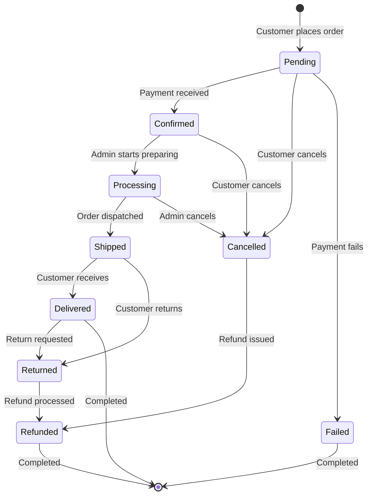
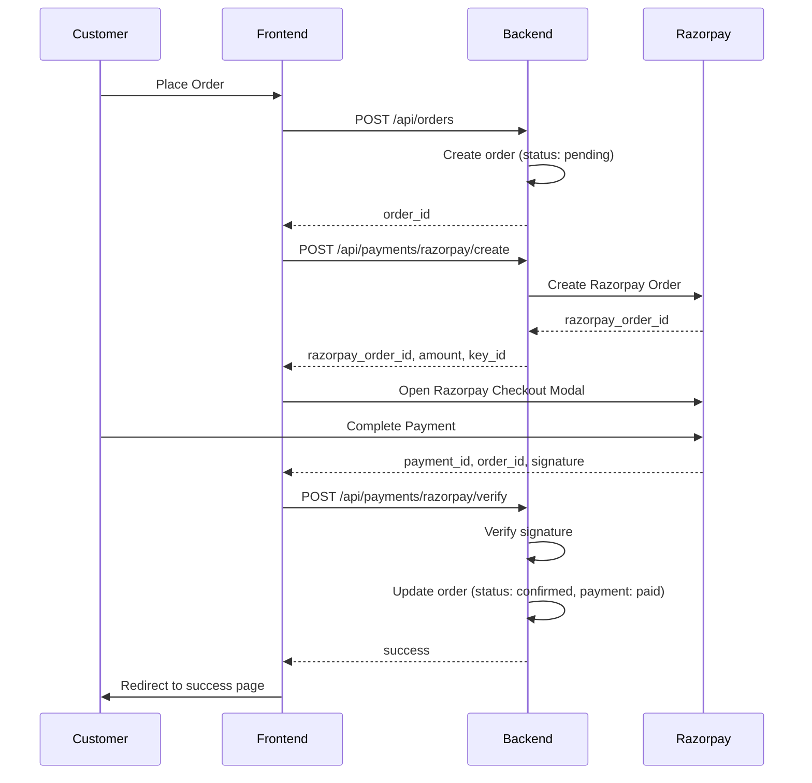

# Order & Inventory Flow Test Suite

> **Purpose**: Comprehensive testing framework for validating the complete order lifecycle, inventory management, payment processing, and edge cases across the Anant Enterprises platform.

---

## Table of Contents

1. [System Architecture Overview](#1-system-architecture-overview)
2. [Status Definitions](#2-status-definitions)
3. [Order Lifecycle Flow](#3-order-lifecycle-flow)
4. [Inventory Management](#4-inventory-management)
5. [Payment Processing](#5-payment-processing)
6. [Test Scenarios](#6-test-scenarios)
7. [Edge Cases](#7-edge-cases)
8. [Testing Strategy](#8-testing-strategy)

---

## 1. System Architecture Overview

### 1.1 System Components

```
┌─────────────────┐      ┌──────────────────┐      ┌─────────────────┐
│   Frontend      │      │   Admin Panel    │      │   Backend API   │
│   (Next.js)     │◄────►│   (React)        │◄────►│   (Node.js)     │
└─────────────────┘      └──────────────────┘      └─────────────────┘
        │                                                    │
        │                                                    │
        ▼                                                    ▼
┌─────────────────────────────────────────────────────────────────────┐
│                         PostgreSQL Database                          │
│  ┌──────────┐  ┌──────────┐  ┌──────────┐  ┌────────────────────┐ │
│  │ Products │  │  Orders  │  │   Cart   │  │     Inventory      │ │
│  │ Variants │  │  Items   │  │  Items   │  │   Adjustments      │ │
│  └──────────┘  └──────────┘  └──────────┘  └────────────────────┘ │
└─────────────────────────────────────────────────────────────────────┘
        │                                                    │
        ▼                                                    ▼
┌─────────────────┐                              ┌─────────────────────┐
│  Redis Cache    │                              │  BullMQ Queues      │
│  - Sessions     │                              │  - Order Events     │
│  - Cart Data    │                              │  - Payment Events   │
└─────────────────┘                              │  - Inventory Events │
                                                 └─────────────────────┘
```

### 1.2 Key Integrations

- **Payment Gateway**: Razorpay (India)
- **Storage**: Supabase Storage (Images, Documents)
- **Email**: Nodemailer with SMTP
- **Queue System**: BullMQ with Redis
- **Database**: PostgreSQL via Supabase

---

## 2. Status Definitions

### 2.1 Order Status

The primary lifecycle status of an order.

| Status | Description | Can Customer Cancel? | Inventory State |
|--------|-------------|----------------------|-----------------|
| `pending` | Order created, awaiting payment | ✅ Yes | Reserved |
| `confirmed` | Payment received/COD approved | ✅ Yes | Reserved |
| `processing` | Being prepared/packed | ❌ No (must contact support) | Reserved |
| `shipped` | Dispatched with carrier | ❌ No (return flow) | Fulfilled (deducted) |
| `delivered` | Successfully delivered | ❌ No (return flow) | Fulfilled |
| `cancelled` | Cancelled before shipment | N/A (terminal) | Released |
| `refunded` | Money returned | N/A (terminal) | Depends on timing |
| `returned` | Item returned after delivery | N/A (requires admin) | Restocked |

### 2.2 Payment Status

Tracks the financial state of the order.

| Status | Description | Typical Trigger |
|--------|-------------|-----------------|
| `pending` | Awaiting payment | Order created |
| `paid` | Full payment received | Razorpay callback / COD confirmed |
| `failed` | Payment attempt failed | Razorpay error |
| `partially_refunded` | Partial refund issued | Admin refund action |
| `refunded` | Full refund issued | Order cancellation / return |

### 2.3 Fulfillment Status

Tracks the physical fulfillment of the order.

| Status | Description | Inventory Impact |
|--------|-------------|------------------|
| `unfulfilled` | Items not yet dispatched | Stock reserved |
| `partial` | Some items dispatched | Partial stock deducted |
| `fulfilled` | All items dispatched/delivered | All stock deducted |
| `cancelled` | Fulfillment cancelled | Stock released |
| `returned` | Items returned to warehouse | Stock restocked |

### 2.4 Inventory Adjustment Types

| Type | Description | Use Case |
|------|-------------|----------|
| `increase` | Add stock | Receiving inventory, returns |
| `decrease` | Remove stock | Order fulfillment, damage |
| `correction` | Adjust discrepancies | Audit corrections, system syncs |
| `write-off` | Permanent removal | Damaged/expired goods |

---

## 3. Order Lifecycle Flow

### 3.1 Complete Order Journey



### 3.2 Detailed Flow Steps

#### Phase 1: Cart to Order (Frontend)

```
1. Customer adds products to cart
   ├─► Inventory: Reserve stock (cart_reservations)
   ├─► Expiry: 30 minutes
   └─► Database: cart_items with reservation_id

2. Customer proceeds to checkout
   ├─► Validate: Stock availability
   ├─► Select: Shipping address
   └─► Choose: Payment method

3. Customer places order
   ├─► API: POST /api/orders
   ├─► Extend: Cart reservations to 60 minutes
   ├─► Validate: Stock still available
   ├─► Create: Order record (status: pending)
   ├─► Create: Order items
   └─► Convert: Cart status to 'converted'
```

#### Phase 2: Payment Processing

**COD (Cash on Delivery):**
```
1. Order created with payment_status: pending
2. Customer clicks "Confirm COD"
   ├─► API: POST /api/payments/cod/process
   ├─► Update: payment_status = 'paid'
   ├─► Update: order_status = 'confirmed'
   └─► Trigger: Order confirmation email
```

**Razorpay (Prepaid):**
```
1. Order created with payment_status: pending
2. Create Razorpay order
   ├─► API: POST /api/payments/razorpay/create
   ├─► Razorpay: Creates payment order
   └─► Return: razorpay_order_id

3. Customer completes payment on Razorpay modal
   ├─► Razorpay: Collects payment
   └─► Returns: payment_id, signature

4. Verify payment
   ├─► API: POST /api/payments/razorpay/verify
   ├─► Verify: Signature using secret key
   ├─► Update: payment_status = 'paid'
   ├─► Update: order_status = 'confirmed'
   └─► Trigger: Order confirmation email
```

#### Phase 3: Order Fulfillment (Admin Panel)

```
1. Admin views order (order_status: confirmed)
   ├─► Dashboard: /orders
   └─► Details: /orders/:id

2. Admin updates to 'processing'
   ├─► API: PUT /api/admin/orders/:id/status
   ├─► Update: order_status = 'processing'
   ├─► Update: fulfillment_status = 'unfulfilled'
   └─► Inventory: Stock still reserved

3. Admin marks as 'shipped'
   ├─► Required: Tracking number
   ├─► API: PUT /api/admin/orders/:id/status
   ├─► Update: order_status = 'shipped'
   ├─► Update: fulfillment_status = 'fulfilled'
   ├─► Inventory: Deduct stock (fulfill reservation)
   │   └─► available_quantity -= quantity
   │   └─► reserved_quantity -= quantity
   └─► Trigger: Shipping email with tracking

4. Auto-update to 'delivered' (via tracking webhook or manual)
   ├─► API: PUT /api/admin/orders/:id/status
   ├─► Update: order_status = 'delivered'
   └─► Trigger: Delivery confirmation email
```

#### Phase 4: Cancellation Flow

**Before Shipment:**
```
1. Customer/Admin cancels order
   ├─► API: POST /api/orders/:id/cancel (customer)
   │   OR PUT /api/admin/orders/:id/status (admin)
   ├─► Validate: Status is 'pending' or 'confirmed'
   ├─► Update: order_status = 'cancelled'
   ├─► Update: fulfillment_status = 'cancelled'
   ├─► Inventory: Release reservation
   │   └─► reserved_quantity -= quantity
   │   └─► available_quantity unchanged (was never deducted)
   └─► Payment: Initiate refund if paid
       ├─► Razorpay: Process refund
       └─► Update: payment_status = 'refunded'
```

**After Shipment (Return Flow):**
```
1. Customer requests return (manual process for now)
   ├─► Customer: Contacts support
   └─► Admin: Approves return

2. Admin marks as 'returned'
   ├─► API: PUT /api/admin/orders/:id/status
   ├─► Update: order_status = 'returned'
   ├─► Update: fulfillment_status = 'returned'
   └─► Inventory: Restock items
       └─► available_quantity += quantity

3. Admin processes refund
   ├─► Update: order_status = 'refunded'
   ├─► Update: payment_status = 'refunded'
   ├─► Razorpay: Process refund
   └─► Trigger: Refund confirmation email
```

---

## 4. Inventory Management

### 4.1 Inventory Table Structure

```typescript
inventory {
  id: uuid;
  product_id: uuid;           // Product reference
  variant_id: uuid | null;    // Variant reference (if applicable)
  location_id: uuid;          // Warehouse location
  
  // CRITICAL: These are MUTUALLY EXCLUSIVE categories
  available_quantity: number; // Stock available for sale (NOT reserved)
  reserved_quantity: number;  // Stock allocated to orders/carts (NOT available)
  incoming_quantity: number;  // Stock on the way (POs, transfers)
  
  // Status fields
  status: 'in_stock' | 'low_stock' | 'out_of_stock';
  condition: 'sellable' | 'damaged' | 'quarantined' | 'expired';
}
```

### 4.2 Stock Calculations

**Total Physical Stock:**
```typescript
total_stock = available_quantity + reserved_quantity
```

**Sellable Stock (what customers can buy):**
```typescript
sellable_stock = available_quantity
```

**Example:**
- Available: 10 units
- Reserved: 5 units (in pending/confirmed orders)
- Total Physical: 10 + 5 = 15 units
- Sellable: 10 units (customers can only buy 10 more)

### 4.3 Inventory Operations

#### 4.3.1 Cart Stock Reservation
```typescript
// When item added to cart
POST /api/cart/items
├─► Validate: available_quantity >= requested_quantity
├─► Update: reserved_quantity += quantity
├─► Create: cart_item with reservation_id
└─► Expiry: 30 minutes (auto-release by cron job)
```

#### 4.3.2 Order Stock Reservation
```typescript
// When order is placed (extends cart reservation)
POST /api/orders
├─► Cart reservations extended to 60 minutes
├─► Validate: Stock still available
├─► Create: Order with reserved stock
└─► Cart reservation transferred to order reservation
```

#### 4.3.3 Order Fulfillment (Stock Deduction)
```typescript
// When order is marked as 'shipped'
PUT /api/admin/orders/:id/status { order_status: 'shipped' }
├─► Update: available_quantity -= quantity (if any left)
├─► Update: reserved_quantity -= quantity
├─► Create: Inventory adjustment (type: 'decrease')
└─► Result: Total stock reduced
```

#### 4.3.4 Cancellation (Stock Release)
```typescript
// When order is cancelled (before shipment)
POST /api/orders/:id/cancel
├─► Update: reserved_quantity -= quantity
├─► Update: available_quantity unchanged (was never deducted)
├─► Create: Inventory adjustment (type: 'correction')
└─► Result: Stock available again for sale
```

#### 4.3.5 Return (Stock Restock)
```typescript
// When order is returned (after delivery)
PUT /api/admin/orders/:id/status { order_status: 'returned' }
├─► Update: available_quantity += quantity
├─► Create: Inventory adjustment (type: 'increase')
└─► Result: Stock back in inventory
```

### 4.4 Inventory Adjustment Audit Trail

Every inventory change is logged in `inventory_adjustments`:

```typescript
inventory_adjustments {
  id: uuid;
  inventory_id: uuid;
  adjustment_type: 'increase' | 'decrease' | 'correction' | 'write-off';
  quantity_change: number;     // +5, -3, etc.
  quantity_before: number;     // 10
  quantity_after: number;      // 15 (if +5 increase)
  reason: string;              // "Order ORD-123 placed"
  reference_number: string;    // "ORD-123"
  adjusted_by: uuid;
  created_at: timestamp;
}
```

---

## 5. Payment Processing

### 5.1 Payment Methods

1. **Cash on Delivery (COD)**
   - Payment collected upon delivery
   - Order marked as `paid` when admin confirms delivery
   - No payment gateway integration required

2. **Razorpay (Prepaid)**
   - Credit/Debit Cards
   - UPI
   - Net Banking
   - Wallets

### 5.2 Razorpay Integration Flow



### 5.3 Payment State Machine

```
pending ──────► paid ──────► refunded
   │                            ▲
   │                            │
   └──────► failed              │
                                │
pending ──────► paid ──────► partially_refunded
```

### 5.4 Refund Processing

```typescript
// Full Refund
POST /api/payments/refund
{
  order_id: "uuid",
  amount: "1000.00",  // Full order amount
  reason: "Order cancelled"
}
├─► Razorpay: Process refund
├─► Update: payment_status = 'refunded'
└─► Trigger: Refund email

// Partial Refund (e.g., one item returned)
POST /api/payments/refund
{
  order_id: "uuid",
  amount: "300.00",   // Partial amount
  reason: "Item damaged"
}
├─► Razorpay: Process partial refund
├─► Update: payment_status = 'partially_refunded'
└─► Trigger: Partial refund email
```

---

## 6. Test Scenarios

### 6.1 Happy Path Scenarios

#### Scenario 1: COD Order - Complete Success
```
1. Add 3 products to cart (all in stock)
2. Proceed to checkout
3. Select delivery address
4. Choose COD payment
5. Place order
6. Confirm COD payment
7. Admin marks as processing
8. Admin marks as shipped (with tracking)
9. Order auto-updates to delivered

Expected Results:
✅ Order status: delivered
✅ Payment status: paid
✅ Fulfillment status: fulfilled
✅ Inventory: Stock deducted correctly
✅ Emails: Confirmation, shipped, delivered
```

#### Scenario 2: Razorpay Order - Complete Success
```
1. Add 2 products to cart
2. Proceed to checkout
3. Select payment method: Razorpay
4. Place order
5. Complete payment on Razorpay
6. Payment verification succeeds
7. Admin marks as processing
8. Admin marks as shipped
9. Order delivered

Expected Results:
✅ Order status: delivered
✅ Payment status: paid
✅ Razorpay: Payment captured
✅ Inventory: Stock deducted
✅ All emails sent
```

#### Scenario 3: Order Cancellation (Before Shipment)
```
1. Place order (COD/Razorpay)
2. Payment completed
3. Order status: confirmed
4. Customer cancels order
5. System releases inventory
6. Refund processed (if paid)

Expected Results:
✅ Order status: cancelled
✅ Payment status: refunded (if prepaid)
✅ Fulfillment status: cancelled
✅ Inventory: Reserved stock released
✅ Refund email sent
```

#### Scenario 4: Order Return (After Delivery)
```
1. Order delivered
2. Customer requests return
3. Admin approves return
4. Admin marks as returned
5. Inventory restocked
6. Refund processed

Expected Results:
✅ Order status: refunded
✅ Payment status: refunded
✅ Fulfillment status: returned
✅ Inventory: Stock added back
✅ Refund email sent
```

### 6.2 Edge Case Scenarios

#### Edge Case 1: Insufficient Stock During Checkout
```
1. Customer adds 10 units to cart (available: 10)
2. Another customer buys 5 units
3. First customer proceeds to checkout (now only 5 available)
4. Place order attempt

Expected Results:
❌ Order creation fails
✅ Error: "Insufficient stock: Only 5 units available"
✅ Cart still exists
✅ Customer can reduce quantity
```

#### Edge Case 2: Cart Reservation Expiry
```
1. Add items to cart
2. Wait 31 minutes (cart expiry: 30 min)
3. Attempt to place order

Expected Results:
✅ Cart reservations auto-released by cron
✅ Stock available for other customers
❌ Order creation fails if stock sold out
✅ Error: "Cart reservations expired"
```

#### Edge Case 3: Payment Failure (Razorpay)
```
1. Place order
2. Razorpay payment initiated
3. Payment fails (insufficient funds, etc.)

Expected Results:
✅ Order created (status: pending)
✅ Payment status: failed
✅ Customer can retry payment
✅ Cart reservation still active (60 min)
```

#### Edge Case 4: Duplicate Payment Verification
```
1. Place order
2. Complete Razorpay payment
3. Verify payment (success)
4. Attempt to verify same payment again

Expected Results:
✅ Second verification ignored
✅ No duplicate order status updates
✅ Idempotent operation
```

#### Edge Case 5: Order Status Invalid Transition
```
1. Order status: shipped
2. Admin attempts to mark as confirmed

Expected Results:
❌ Status update fails
✅ Error: "Cannot change from shipped to confirmed"
✅ Valid transitions shown
```

#### Edge Case 6: Cancel After Shipment
```
1. Order status: shipped
2. Customer attempts to cancel

Expected Results:
❌ Cancellation fails
✅ Error: "Cannot cancel shipped orders. Please contact support for returns."
✅ Customer redirected to support/return flow
```

#### Edge Case 7: Concurrent Stock Updates
```
1. Product has 5 units available
2. Two customers simultaneously add 3 units to cart

Expected Results:
✅ First customer: Success (5 - 3 = 2 left)
✅ Second customer: Success (2 - 3 = -1)
❌ One customer gets "insufficient stock" error
✅ Database constraints prevent overselling
```

#### Edge Case 8: Refund Without Payment
```
1. Order status: cancelled
2. Payment status: pending (COD never paid)
3. Admin attempts refund

Expected Results:
❌ Refund fails
✅ Error: "Cannot refund unpaid order"
✅ Order remains cancelled
```

#### Edge Case 9: Partial Fulfillment
```
1. Order has 3 items
2. Admin ships 2 items (1 out of stock)
3. Update fulfillment status

Expected Results:
✅ Fulfillment status: partial
✅ 2 items: Stock deducted
✅ 1 item: Stock still reserved
✅ Customer notified of partial shipment
```

#### Edge Case 10: Return Without Restock
```
1. Order returned
2. Item damaged, cannot resell
3. Admin processes return without restocking

Expected Results:
✅ Order status: returned
✅ Payment status: refunded
✅ Inventory: Not restocked (optional flag)
✅ Adjustment: type = 'write-off'
```

---

## 7. Edge Cases

### 7.1 Inventory Edge Cases

| # | Scenario | Expected Behavior |
|---|----------|-------------------|
| 1 | Negative stock | Database constraint prevents negative `available_quantity` |
| 2 | Reserved > Available | Allowed (historical orders can exceed current stock) |
| 3 | Stock adjustment during order | Transaction isolation prevents race conditions |
| 4 | Multiple warehouses | Each location tracks separate inventory |
| 5 | Variant stock | Variants have separate inventory records |

### 7.2 Payment Edge Cases

| # | Scenario | Expected Behavior |
|---|----------|-------------------|
| 1 | Payment gateway timeout | Retry mechanism, order remains pending |
| 2 | Double payment | Idempotent verification, second attempt ignored |
| 3 | Partial refund multiple times | Track cumulative refund amount |
| 4 | Refund to expired card | Razorpay handles, bank processes |
| 5 | COD not collected | Manual admin action to cancel order |

### 7.3 Order Edge Cases

| # | Scenario | Expected Behavior |
|---|----------|-------------------|
| 1 | Orphan order (no user) | Guest orders allowed (user_id nullable) |
| 2 | Order without address | Validation fails, address required |
| 3 | Order with deleted product | Soft delete, order items retain product data |
| 4 | Duplicate order number | UUID + auto-increment ensures uniqueness |
| 5 | Order stuck in processing | Admin monitoring dashboard alerts |

---

## 8. Testing Strategy

### 8.1 Test Structure

Each test script will follow this pattern:

```typescript
// test-001-happy-path-cod.ts

import { db } from '../../../database';
import { createTestUser, createTestProduct } from '../helpers';

describe('Happy Path: COD Order Complete Flow', () => {
  let userId: string;
  let productId: string;
  let orderId: string;

  beforeAll(async () => {
    // Setup test data
    userId = await createTestUser();
    productId = await createTestProduct({ stock: 100 });
  });

  test('1. Add product to cart', async () => {
    // Test cart creation
  });

  test('2. Place order with COD', async () => {
    // Test order creation
  });

  test('3. Confirm COD payment', async () => {
    // Test payment confirmation
  });

  test('4. Mark as shipped', async () => {
    // Test order fulfillment
  });

  test('5. Verify inventory deduction', async () => {
    // Verify stock reduced
  });

  afterAll(async () => {
    // Cleanup test data
  });
});
```

### 8.2 Test Categories

1. **Happy Path Tests** (`test-0XX-happy-*.ts`)
   - Complete successful flows
   - All status transitions working
   - Emails, inventory, payments all correct

2. **Edge Case Tests** (`test-1XX-edge-*.ts`)
   - Insufficient stock
   - Payment failures
   - Invalid transitions
   - Concurrent operations

3. **Integration Tests** (`test-2XX-integration-*.ts`)
   - Full end-to-end flows
   - Multiple systems working together
   - Real payment gateway (test mode)

4. **Performance Tests** (`test-3XX-performance-*.ts`)
   - High load scenarios
   - Concurrent orders
   - Database query performance

5. **Error Recovery Tests** (`test-4XX-recovery-*.ts`)
   - Network failures
   - Database rollbacks
   - Queue failures

### 8.3 Test Data Setup

```typescript
// helpers/test-data.ts

export async function createTestUser(role: 'customer' | 'admin' = 'customer') {
  // Create user in database
}

export async function createTestProduct(options: {
  stock?: number;
  price?: number;
  hasVariants?: boolean;
}) {
  // Create product with inventory
}

export async function createTestOrder(options: {
  userId: string;
  items: Array<{ productId: string; quantity: number }>;
  paymentMethod: 'cod' | 'razorpay';
}) {
  // Create complete order
}

export async function cleanupTestData() {
  // Remove all test records
}
```

### 8.4 Assertion Helpers

```typescript
// helpers/assertions.ts

export async function assertOrderStatus(
  orderId: string,
  expectedStatus: OrderStatus
) {
  const order = await db.select().from(orders).where(eq(orders.id, orderId));
  expect(order[0].order_status).toBe(expectedStatus);
}

export async function assertInventoryDeducted(
  productId: string,
  expectedDeduction: number
) {
  const inventory = await db.select().from(inventory).where(eq(inventory.product_id, productId));
  // Verify stock reduced by expectedDeduction
}

export async function assertPaymentCaptured(
  orderId: string,
  expectedAmount: number
) {
  // Verify payment record exists and amount matches
}
```

### 8.5 Test Execution Plan

1. **Unit Tests**: Individual functions
2. **API Tests**: Endpoint testing
3. **Integration Tests**: Full flows
4. **E2E Tests**: Browser automation (Playwright)
5. **Load Tests**: Performance benchmarking

### 8.6 Test Coverage Goals

- **Backend APIs**: 90%+ coverage
- **Order Services**: 95%+ coverage
- **Inventory Services**: 95%+ coverage
- **Payment Services**: 90%+ coverage
- **Edge Cases**: 100% documented scenarios

---

## 9. Next Steps

### 9.1 Implementation Order

1. ✅ **Phase 1**: Documentation (this README)
2. 🔄 **Phase 2**: Test helpers and utilities
3. 📝 **Phase 3**: Happy path test scripts
4. 📝 **Phase 4**: Edge case test scripts
5. 📝 **Phase 5**: Integration test scripts
6. 📝 **Phase 6**: Performance test scripts
7. 📝 **Phase 7**: Error recovery test scripts

### 9.2 Test Scripts to Create

#### Happy Path (Priority 1)
- `test-001-happy-path-cod-order.ts`
- `test-002-happy-path-razorpay-order.ts`
- `test-003-happy-path-order-cancellation.ts`
- `test-004-happy-path-order-return.ts`

#### Edge Cases (Priority 2)
- `test-101-edge-insufficient-stock.ts`
- `test-102-edge-cart-expiry.ts`
- `test-103-edge-payment-failure.ts`
- `test-104-edge-invalid-status-transition.ts`
- `test-105-edge-concurrent-stock-updates.ts`
- `test-106-edge-cancel-after-shipment.ts`
- `test-107-edge-duplicate-payment-verification.ts`
- `test-108-edge-refund-without-payment.ts`
- `test-109-edge-partial-fulfillment.ts`
- `test-110-edge-return-without-restock.ts`

#### Integration (Priority 3)
- `test-201-integration-full-order-lifecycle.ts`
- `test-202-integration-cart-to-delivered.ts`
- `test-203-integration-multiple-orders-same-product.ts`
- `test-204-integration-razorpay-webhook-handling.ts`

#### Performance (Priority 4)
- `test-301-performance-concurrent-orders.ts`
- `test-302-performance-high-load-checkout.ts`
- `test-303-performance-inventory-queries.ts`

#### Error Recovery (Priority 5)
- `test-401-recovery-database-rollback.ts`
- `test-402-recovery-payment-gateway-timeout.ts`
- `test-403-recovery-queue-failure.ts`

---

## 10. Monitoring & Alerts

### 10.1 Key Metrics to Track

- Order success rate
- Payment success rate
- Average order processing time
- Inventory accuracy rate
- Cart abandonment rate
- Refund rate
- Customer cancellation rate

### 10.2 Alert Conditions

- Payment failures > 5%
- Order stuck in pending > 1 hour
- Inventory discrepancy detected
- Refund processing failure
- Queue backlog > 100 jobs

---

## 11. API Endpoints Reference

### 11.1 Order APIs

| Method | Endpoint | Description | Auth |
|--------|----------|-------------|------|
| GET | `/api/orders` | Get user's orders | Required |
| GET | `/api/orders/:id` | Get order details | Required |
| POST | `/api/orders` | Create order from cart | Required |
| POST | `/api/orders/:id/cancel` | Cancel order | Required |
| GET | `/api/admin/orders` | Get all orders | Admin |
| PUT | `/api/admin/orders/:id/status` | Update order status | Admin |

### 11.2 Payment APIs

| Method | Endpoint | Description | Auth |
|--------|----------|-------------|------|
| POST | `/api/payments/razorpay/create` | Create Razorpay order | Required |
| POST | `/api/payments/razorpay/verify` | Verify payment | Required |
| POST | `/api/payments/cod/process` | Process COD payment | Required |
| POST | `/api/payments/refund` | Initiate refund | Admin |

### 11.3 Inventory APIs

| Method | Endpoint | Description | Auth |
|--------|----------|-------------|------|
| GET | `/api/inventory/products/:id` | Get product inventory | Public |
| POST | `/api/admin/inventory/adjust` | Manual stock adjustment | Admin |
| GET | `/api/admin/inventory/adjustments` | Get adjustment history | Admin |

### 11.4 Cart APIs

| Method | Endpoint | Description | Auth |
|--------|----------|-------------|------|
| GET | `/api/cart` | Get active cart | Required |
| POST | `/api/cart/items` | Add item to cart | Required |
| PATCH | `/api/cart/items/:id` | Update cart item | Required |
| DELETE | `/api/cart/items/:id` | Remove cart item | Required |

---

## 12. Database Schema Quick Reference

### Orders Table
```sql
orders (
  id uuid PRIMARY KEY,
  order_number varchar UNIQUE,
  user_id uuid REFERENCES users,
  order_status order_status_enum,
  payment_status payment_status_enum,
  fulfillment_status fulfillment_status_enum,
  payment_method varchar,
  subtotal decimal,
  tax_amount decimal,
  shipping_charges decimal,
  discount_amount decimal,
  total_amount decimal,
  order_tracking varchar,
  created_at timestamp,
  updated_at timestamp
)
```

### Inventory Table
```sql
inventory (
  id uuid PRIMARY KEY,
  product_id uuid REFERENCES products,
  variant_id uuid REFERENCES product_variants,
  location_id uuid REFERENCES inventory_locations,
  available_quantity integer NOT NULL,  -- Stock available for sale
  reserved_quantity integer NOT NULL,   -- Stock reserved for orders
  incoming_quantity integer NOT NULL,   -- Stock on the way
  status inventory_status_enum,
  condition inventory_condition_enum,
  created_at timestamp,
  updated_at timestamp
)
```

### Inventory Adjustments Table
```sql
inventory_adjustments (
  id uuid PRIMARY KEY,
  inventory_id uuid REFERENCES inventory,
  adjustment_type adjustment_type_enum,
  quantity_change integer,
  quantity_before integer,
  quantity_after integer,
  reason text,
  reference_number varchar,
  adjusted_by uuid REFERENCES users,
  created_at timestamp
)
```

---

## 13. Glossary

- **Available Quantity**: Stock that can be sold immediately (not reserved)
- **Reserved Quantity**: Stock allocated to orders/carts but not yet fulfilled
- **Fulfillment**: The process of preparing and shipping an order
- **Cart Reservation**: Temporary hold on inventory for cart items (30 min)
- **Order Reservation**: Extended hold on inventory for confirmed orders (60 min)
- **Stock Deduction**: Permanent removal of stock when order is fulfilled
- **Stock Release**: Returning reserved stock to available pool (cancellation)
- **Stock Restock**: Adding returned items back to available inventory
- **Idempotent**: Operation that produces same result regardless of repetition
- **Atomic Transaction**: All-or-nothing database operation

---

**Document Version**: 1.0  
**Last Updated**: February 3, 2026  
**Maintained By**: Development Team
