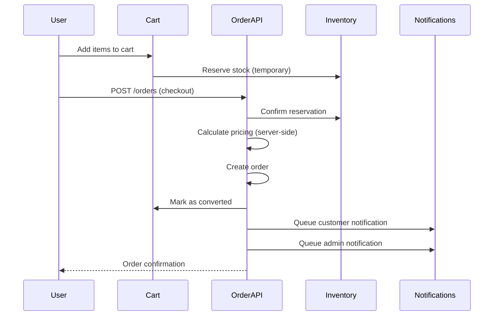
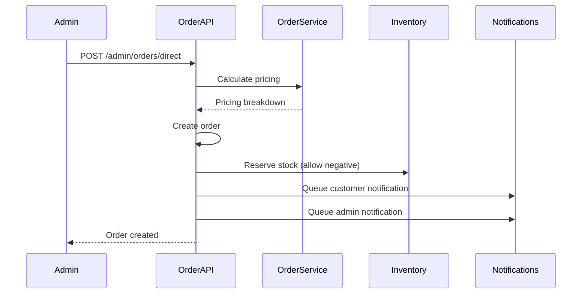
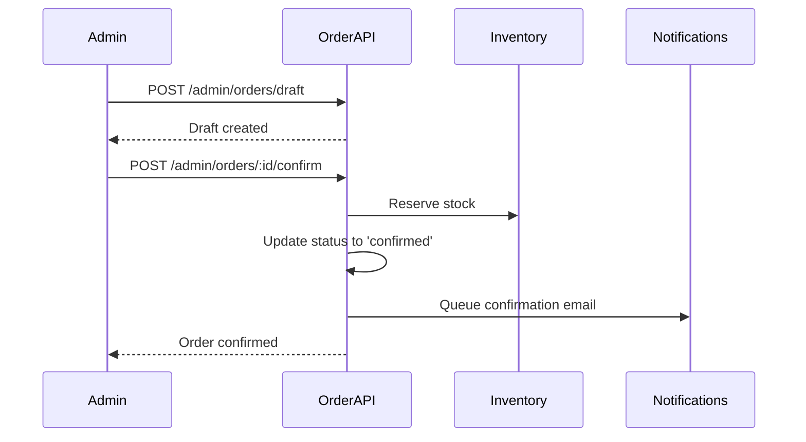
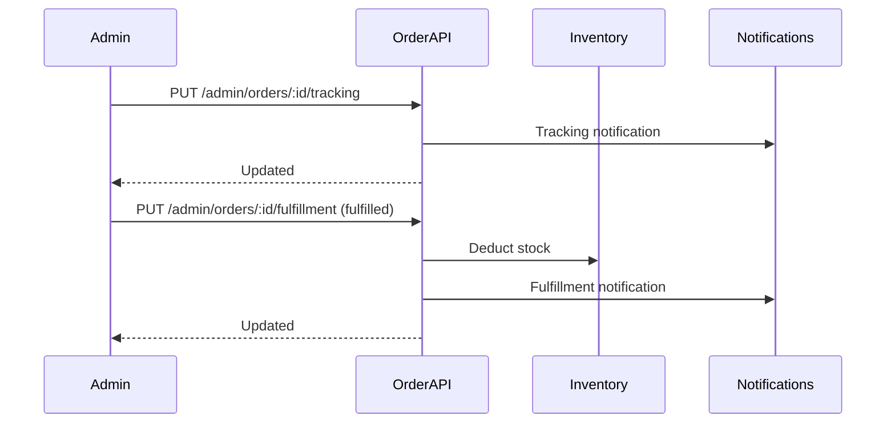

# Orders Feature

Complete order management system for the e-commerce platform supporting cart-based checkout, admin-created orders, and comprehensive order lifecycle management.

---

## Table of Contents

- [Architecture](#architecture)
- [API Endpoints](#api-endpoints)
- [Permissions](#permissions)
- [Common Workflows](#common-workflows)
- [Notification Events](#notification-events)
- [Integration Points](#integration-points)
- [Data Models](#data-models)

---

## Architecture

### Directory Structure

```
orders/
├── apis/                    # API route handlers (26 files)
│   ├── create-order.ts     # User: Create from cart
│   ├── create-order-direct.ts  # Admin: Direct order creation
│   ├── confirm-draft-order.ts  # Admin: Confirm draft
│   ├── update-*.ts         # Status update endpoints
│   └── get-*.ts            # Query endpoints
├── services/
│   └── order.service.ts    # Business logic (pricing, validation)
├── shared/
│   ├── orders.schema.ts    # Database schema
│   ├── order-items.schema.ts
│   ├── validation.ts       # Zod schemas
│   ├── interface.ts        # TypeScript types
│   ├── order-helpers.ts    # Utility functions
│   ├── utils.ts            # Helper utilities
│   └── index.ts            # Public exports
└── README.md               # This file
```

### Core Components

**Services:**
- `OrderService` - Pricing calculation, order number generation, tax calculation

**Helpers:**
- `queueCustomerOrderNotification()` - Customer email notifications
- `queueAdminOrderNotification()` - Admin alert notifications
- `validateAndWarnStock()` - Stock availability validation
- `mapCartItemsToOrderItems()` - Cart to order item conversion

**Schemas:**
- `orders` - Main order table
- `orderItems` - Line items for each order

---

## API Endpoints

### User Routes (`POST /api/orders`)

| Method | Endpoint | Description | Auth |
|--------|----------|-------------|------|
| POST | `/orders` | Create order from cart | User |
| GET | `/orders` | List user's orders | User |
| GET | `/orders/:id` | Get order details | User (own orders) |
| POST | `/orders/:id/cancel` | Cancel order | User (own orders) |

### Admin Routes (`POST /api/admin/orders`)

#### Order Management

| Method | Endpoint | Description | Permission |
|--------|----------|-------------|------------|
| POST | `/admin/orders/direct` | Create order directly | `orders:create` |
| GET | `/admin/orders` | List all orders | `orders:read` |
| GET | `/admin/orders/:id` | Get order details | `orders:read` |
| PUT | `/admin/orders/:id` | Update order | `orders:update` |
| DELETE | `/admin/orders` | Delete orders (bulk) | `orders:delete` |

#### Status Updates

| Method | Endpoint | Description | Permission |
|--------|----------|-------------|------------|
| PUT | `/admin/orders/:id/status` | Update order status | `orders:update` |
| PUT | `/admin/orders/:id/payment` | Update payment status | `orders:update` |
| PUT | `/admin/orders/:id/tracking` | Add tracking info | `orders:update` |
| PUT | `/admin/orders/:id/fulfillment` | Update fulfillment | `orders:update` |

#### Draft Orders

| Method | Endpoint | Description | Permission |
|--------|----------|-------------|------------|
| POST | `/admin/orders/draft` | Create draft order | `orders:create` |
| POST | `/admin/orders/:id/confirm` | Confirm draft | `orders:update` |

#### Analytics & Export

| Method | Endpoint | Description | Permission |
|--------|----------|-------------|------------|
| GET | `/admin/orders/metrics` | Order metrics/stats | `orders:read` |
| GET | `/admin/orders/export` | Export orders (CSV) | `orders:read` |

---

## Permissions

### Permission Matrix

| Action | Permission | Description |
|--------|-----------|-------------|
| View Orders | `orders:read` | View order list and details |
| Create Orders | `orders:create` | Create new orders (admin) |
| Update Orders | `orders:update` | Modify order details and status |
| Cancel Orders | `orders:delete` | Cancel/delete orders |

### Special Cases

- **Users** can only access their own orders (no permission required)
- **Draft orders** require `orders:create` to create, `orders:update` to confirm
- **Bulk operations** (delete, export) require appropriate permission
- **Metrics** require `orders:read` permission

---

## Common Workflows

### 1. Cart Checkout (User Flow)



**Key Points:**
- Stock reserved when items added to cart
- Pricing calculated server-side (security)
- Cart automatically marked as converted
- Dual notifications (customer + admin)

---

### 2. Admin Direct Order Creation



**Key Points:**
- Admin provides item details only (no prices)
- Server calculates all pricing (prevents manipulation)
- Can override stock limits (admin privilege)
- Notifications sent automatically

---

### 3. Draft Order Confirmation



**Key Points:**
- Draft orders don't reserve stock initially
- Stock reserved upon confirmation
- Optional confirmation email to customer

---

### 4. Order Fulfillment Flow



**Key Points:**
- Tracking update triggers customer notification
- Fulfillment triggers inventory deduction
- Each status change notifies customer

---

## Notification Events

The orders feature sends notifications for various lifecycle events:

| Event | Template Code | Trigger | Recipient |
|-------|---------------|---------|-----------|
| Order Created | `ORDER_CREATED` | User creates order | Customer |
| New Order | `NEW_ORDER_RECEIVED` | Any order created | Admin |
| Order Confirmed | `ORDER_CONFIRMED` | Draft confirmed | Customer |
| Tracking Updated | `ORDER_TRACKING_UPDATED` | Tracking added | Customer |
| Payment Confirmed | `ORDER_PAYMENT_CONFIRMED` | Payment status = paid | Customer |
| Fulfillment Updated | `ORDER_FULFILLMENT_UPDATED` | Fulfillment status changed | Customer |

### Notification Pattern

All notifications use non-blocking async pattern:

```typescript
setImmediate(async () => {
    try {
        await eventPublisher.publishNotification({
            userId: order.user_id,
            templateCode: TEMPLATE_CODES.ORDER_CONFIRMED,
            variables: { orderNumber, totalAmount, ... },
            options: { priority: 'high', actionUrl: '/orders/...' },
        });
    } catch (error) {
        logger.error('Notification failed:', error);
        // Don't throw - notifications are non-critical
    }
});
```

---

## Integration Points

### 1. Inventory Service

**Used for:**
- Stock validation (`validateStockAvailability`)
- Stock reservation (`reservestockForOrder`)
- Stock fulfillment (`fulfillOrderInventory`)

**Files:**
- `create-order.ts` - Validates stock before order creation
- `confirm-draft-order.ts` - Reserves stock on confirmation
- `update-fulfillment-status.ts` - Deducts stock when fulfilled

---

### 2. Cart Service

**Used for:**
- Fetching cart items for checkout
- Converting cart to order
- Releasing cart reservations

**Files:**
- `create-order.ts` - Converts cart to order

---

### 3. Notifications/Queue

**Used for:**
- Customer email notifications
- Admin alert notifications
- Async event processing

**Files:**
- All order creation/update endpoints
- Uses `eventPublisher.publishNotification()`

---

### 4. User Service

**Used for:**
- Fetching customer details
- Validating user permissions

**Files:**
- Order enrichment (get endpoints)
- Customer name resolution

---

## Data Models

### Orders Table

Key fields:
- `id` - UUID primary key
- `order_number` - Unique human-readable ID (e.g., "ORD-2024-001234")
- `user_id` - Customer reference (nullable for guest orders)
- `order_status` - `pending`, `confirmed`, `processing`, `shipped`, `delivered`, `cancelled`
- `payment_status` - `pending`, `paid`, `refunded`, `failed`
- `fulfillment_status` - `unfulfilled`, `fulfilled`, `returned`, `cancelled`
- **Pricing fields** (all calculated server-side):
  - `subtotal`, `discount_amount`, `tax_amount`, `shipping_amount`, `total_amount`
  - `cgst`, `sgst`, `igst` (Indian tax components)
- **Addresses** - Billing and shipping details (embedded JSON)
- **Metadata** - `created_by`, `updated_by`, `inventory_reserved`, etc.

### Order Items Table

Key fields:
- `id` - UUID primary key
- `order_id` - Foreign key to orders
- `product_id` - Product reference
- `quantity` - Quantity ordered
- `unit_price` - Price per unit (snapshot at order time)
- `subtotal` - `quantity * unit_price`
- `discount_amount` - Item-level discount
- `tax_amount` - Item-level tax
- `total_amount` - Final line item total

---

## Security Considerations

### 1. Server-Side Pricing Calculation

**Critical:** All pricing is calculated server-side to prevent price manipulation.

```typescript
// ❌ NEVER accept prices from client
const order = { total_amount: req.body.total_amount }; // DANGEROUS!

// ✅ ALWAYS calculate server-side
const pricing = await orderService.calculateOrderPricing({
    items: req.body.items,
    discount_code: req.body.discount_code,
});
const order = { total_amount: pricing.total_amount }; // SAFE
```

**Affected endpoints:**
- `create-order.ts` ✅ Uses service
- `create-order-direct.ts` ✅ Uses service
- `update-order.ts` ✅ Recalculates if items change

---

### 2. Permission Checks

All admin endpoints require appropriate permissions:

```typescript
router.post(
    '/admin/orders/direct',
    requireAuth,              // Must be authenticated
    requirePermission('orders:create'),  // Must have permission
    handler
);
```

---

### 3. User Data Isolation

Users can only access their own orders:

```typescript
// User endpoints automatically filter by user_id
const orders = await db
    .select()
    .from(orders)
    .where(eq(orders.user_id, req.userId));  // Enforced
```

---

## Performance Considerations

### 1. Pagination

All list endpoints support pagination:

```typescript
GET /orders?page=1&limit=20
GET /admin/orders?page=1&limit=50
```

### 2. Selective Field Loading

Detail endpoints can include/exclude relations:

```typescript
GET /orders/:id?include=items,customer,addresses
```

### 3. Caching (Future)

Metrics endpoint recommended for caching (5-minute TTL):

```typescript
GET /admin/orders/metrics  // Cache with Redis
```

---

## Testing Recommendations

### Manual Testing Checklist

**User Flow:**
- [ ] Add items to cart
- [ ] Create order from cart
- [ ] View order list
- [ ] View order details
- [ ] Cancel order

**Admin Flow:**
- [ ] Create direct order
- [ ] Create draft order
- [ ] Confirm draft
- [ ] Update tracking
- [ ] Update payment status
- [ ] Update fulfillment status
- [ ] View metrics
- [ ] Export orders

**Notifications:**
- [ ] Customer receives order confirmation
- [ ] Admin receives new order alert
- [ ] Customer receives tracking notification
- [ ] Customer receives payment confirmation
- [ ] Customer receives fulfillment update

---

## Troubleshooting

### Common Issues

**Issue:** "Order not found"
- Check order ID is valid UUID
- User endpoints: Verify order belongs to user
- Admin endpoints: Verify permission

**Issue:** "Insufficient stock"
- Check inventory levels
- Admin can override with `allow_negative_stock`

**Issue:** "Invalid discount code"
- Verify code is active and not expired
- Check usage limits and constraints

**Issue:** "Notifications not sent"
- Check Redis connection
- Check queue workers running
- Review notification service logs

---

## Future Enhancements

- [ ] Carrier API integration for real-time tracking
- [ ] Automated refund processing
- [ ] Accounting system integration
- [ ] Order timeline/audit log
- [ ] Advanced metrics dashboard
- [ ] Subscription/recurring orders
- [ ] Multi-currency support

---

## Support

For questions or issues:
1. Check this README
2. Review implementation plan artifacts
3. Check application logs
4. Contact development team

---

**Last Updated:** 2026-02-02  
**Version:** 1.0 (Phase 6 Complete)
